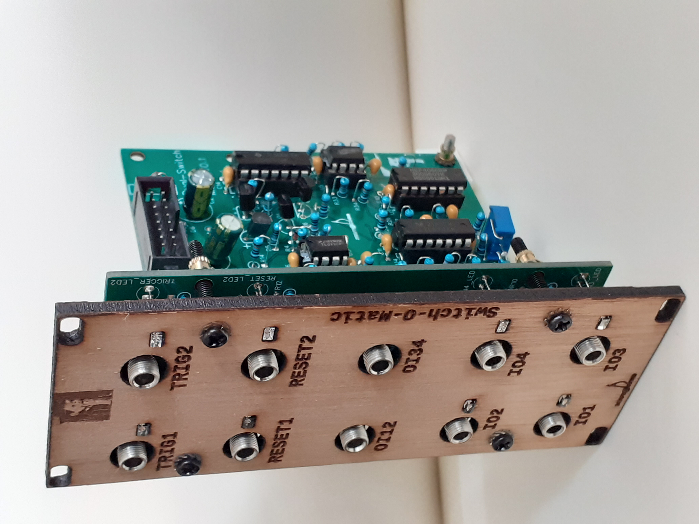

#Switch-O-Matic

This is a dual toggle analog switch based on a CD4066.
Input and output values are fit for audio signals and CV signals.
Signal levels allowed are AC and DC -8V ... 8V.
The switch toggles between the inputs and the reset signal can be used to synchronize the switch.
The inputs and outputs are bidirectional.

